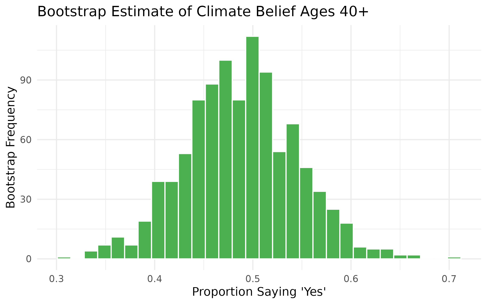
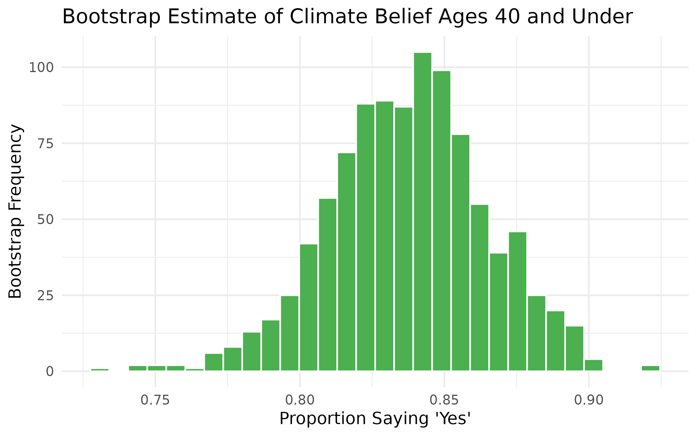

How Do Demographics Shape Climate Change Beliefs?
================
by Dylan Janowski

## Summary

This project examined how demographic factors relate to beliefs about climate change. Public opinion is important because it affects environmental policy, political priorities, and support for climate action. The goal of this project was to determine whether beliefs about climate change differ across demographic groups, specifically by age and community type.

The dataset used in this analysis came from an original survey created and distributed using Google Forms (https://forms.gle/9XVQnRjwUSQFDJ8i8). The survey focused on climate change opinions and demographic information. The final dataset contained 262 respondents and 23 variables. Questions included beliefs about whether climate change is happening, whether humans are responsible, support for environmental regulations, and opinions on government and corporate responsibility. Demographic variables included age, education, and current community type.

The main research questions were:

Does belief in human-caused climate change differ by current community type?

Does belief in human-caused climate change differ by age group?

Are these differences statistically significant?

The first step involved cleaning and organizing the dataset. Variables were renamed so they would be easier to use during analysis. All variables were converted to factor format because the survey responses were categorical.

```{r}
data <- data %>%
  mutate(across(everything(), as.factor))
```

The analysis focused mainly on the variables human_cause, community_current, and age. To simplify comparisons between age groups, respondents were grouped into two broader categories: “40 and under” and “40 and above.”

```{r}
data <- data %>%
  mutate(
    age_group = case_when(
      age == "Under 20" | age == "20-30" |
        age == "30-40" ~ "40 and under",
      age == "40-50" | age == "50-60" |
        age == "60+" ~ "40 and above"
    )
  )
```

The first part of the analysis examined whether climate change beliefs differed across community types. Proportional bar charts created with ggplot2 showed noticeable variation between communities. Rural and suburban groups had a substantially lower rate of saying “yes” to believing in human-caused climate change.

To determine whether these differences were statistically significant, a chi-square test of independence was performed.

```{r}
chisq.test(table(data$community_current, data$human_cause))
```

The test produced a chi-square statistic of 23.788 and a p-value of 8.81 × 10⁻⁵. Because the p-value was much smaller than 0.05, the null hypothesis was rejected. This indicates that there is a statistically significant relationship between community type and belief in human-caused climate change. In other words, beliefs about climate change were not evenly distributed across different community groups.

The second part of the project examined differences by age group. The graphs showed that younger respondents were much more likely to believe climate change is primarily caused by human activity. Older respondents showed lower agreement levels and greater variation in responses. The bar graph for age groups, separated into ten-year intervals, also showed a clear distribution pattern: a much higher proportion of respondents under 40 answered “yes,” while significantly fewer respondents over 40 agreed. Based on this pattern, further investigation was done by grouping respondents into two age categories and testing for differences between them.

Bootstrap sampling was used to estimate the proportion of respondents in each age group who answered “Yes.” For respondents age 40 and above, the bootstrap estimate showed that about 49% believed climate change is human-caused. The confidence interval ranged from approximately 38% to 59%, showing a relatively large amount of uncertainty.



For respondents age 40 and under, the bootstrap estimate showed that about 84% believed climate change is human-caused. The confidence interval ranged from approximately 78% to 89%, showing stronger agreement and less variation compared to the older age group.



Overall, the results showed that both age and community type were associated with differences in climate change beliefs. Younger respondents were more likely to believe climate change is caused by humans, while older respondents were less likely to agree. Community context also appeared to influence climate opinions.

One limitation of the project is that the survey sample was relatively small and regionally focused in the Midwest, so the results may not represent the broader United States population. In addition, survey responses were self-reported, which may introduce bias or inconsistency in how questions were interpreted. Despite these limitations, the analysis demonstrates how demographic factors can help explain differences in environmental beliefs and attitudes.

## Presentation

The presentation can be found [here](presentation/presentation.html)

## Data

Environmental Perspectives Survey Dataset. Distributed using Google Forms. https://forms.gle/9XVQnRjwUSQFDJ8i8

## References

https://forms.gle/9XVQnRjwUSQFDJ8i8
